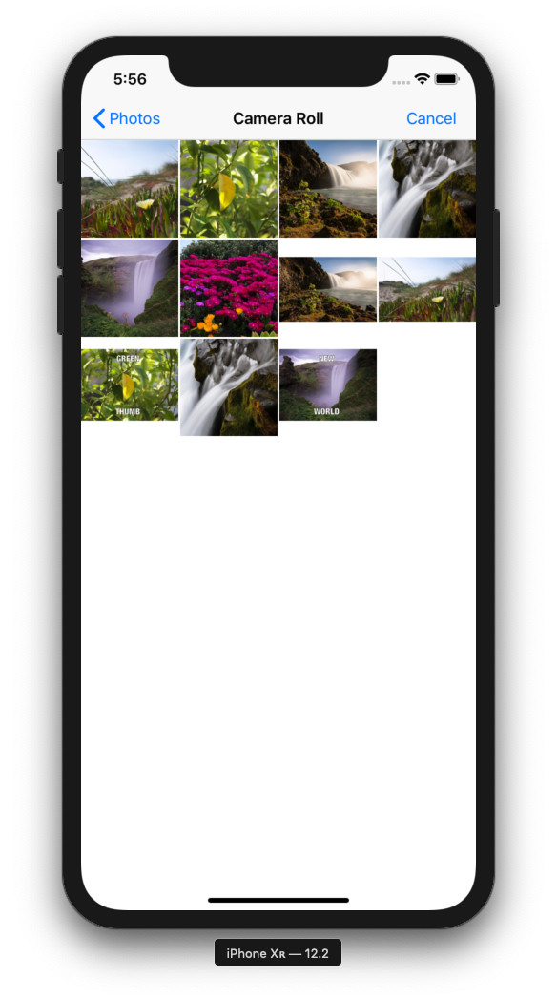

# Udacity iOS Developer Nanodegree - MemeMe2.0 App
This repository contains the MemeMe2.0 app from Udacity's UIKit Fundamentals course. This app builds upon MemeMe1.0 and introduces a 
UITabBarController to switch between a UICollectionView and a UITableView.

## Overview
When MemeMe2.0 is opened, it shows the user a list of previously sent memes in two formats: a table view and a collection view.

 

When the add button in the top right corner of the screen is pressed, it allows the user to create a new meme by selecting an image from their album or taking an image from their camera. This functionality is the same as MemeMe1.0.

   

MemeMe2.0 features landscape support for memes.

 

After the meme is created, the user is brought back to the sent memes screen, which is updated with the new meme.

Clicking on a meme allows users to see the meme in detail in another screen. Here, the user has the option to edit the meme's text to create a new meme. After the new meme is created, the user is brought back to the sent memes screen with the new meme.

   
